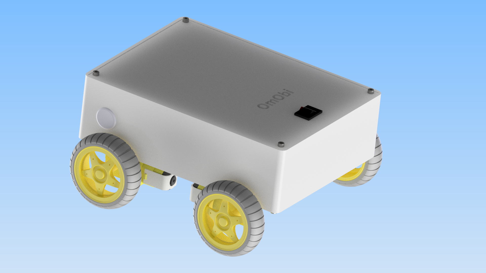

# OmObi-Arduino_mobile_robot
# Bluetooth-Controlled Robot Car with Arduino and HC-05

This repository contains the resources, code, and documentation needed to build a Bluetooth-controlled robot car using an Arduino Uno, HC-05 Bluetooth module, and Adafruit Motor Shield. This project combines robotics, motor control, and mobile app development to create a fun and educational DIY robot for beginners.

## Features
- Wireless control of the robot car via Bluetooth.
- 4-wheel drive with precise motor control using the Adafruit Motor Shield.
- Android app built with MIT App Inventor to control forward, backward, left, and right movements.
- Custom 3D-printed chassis.

## Components
- 4 DC motors with gearboxes
- Adafruit Motor Shield V1.2
- Arduino Uno
- HC-05 Bluetooth Module
- 3D-printed chassis and Arduino holder
- Jumper wires
- Battery
- Smartphone with Android OS

## Assembly Steps
1. **Mount Motors and Components:** Secure DC motors and Arduino with screws.
2. **Wiring:** Connect motors to the Adafruit Motor Shield and the HC-05 Bluetooth module to the Arduino.
3. **Power the Robot:** Connect the battery pack to power the motor shield and Arduino.

## Arduino Code
The Arduino code enables communication between the smartphone app and the robot. Commands such as 'F' (Forward), 'B' (Backward), 'L' (Left), 'R' (Right), and 'S' (Stop) are sent via Bluetooth and control the motors accordingly.

You can find the complete code in the [`robot_car.ino`](Bleutooth_Car_Control.ino) file.

## Android App
The app is built with MIT App Inventor. It allows users to:
- Pair with the HC-05 module.
- Send directional commands by pressing on-screen buttons.
- Stop the robot when buttons are released.

Download the app APK here: [RobotCarControl_SP.apk](RobotCarControl_SP.apk).

## How to Use
1. **Pair Your Device:** Connect your smartphone to the HC-05 module via Bluetooth (default PIN: 1234).
2. **Load the App:** Install, enable nearby devices and open the RobotCarControl app.
3. **Connect to the Robot:** Select the HC-05 module from the app and start controlling the robot using the directional buttons.

## Resources
- **Blog:** [Building a Bluetooth-Controlled Robot Car](https://omartronics.com/building-a-bluetooth-controlled-robot-car-with-arduino-hc-05-and-adafruit-motor-shield/)
- **Arduino and Bluetooth Guide:** [HC-05 Bluetooth Module Tutorial](https://omartronics.com/arduino-and-hc-05-hc-06-bluetooth-module-complete-tutorial/)
- **Arduino Motor Control:** [L298N and Motor Shield Tutorial](https://omartronics.com/controlling-dc-motors-with-l298n-dual-h-bridge-and-arduino-motor-shield/)

## License
This project is licensed under the MIT License. Feel free to use, modify, and share it!

## Future Improvements
- Add obstacle avoidance using an ultrasonic sensor.
- Implement speed control for smoother navigation.
- Enhance app UI with joystick-style controls.
